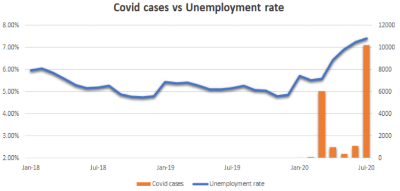

# **Project proposal:** 
## Analyse the impact of Covid-19 on the unemployment rate in Australia and assess the effectiveness of Monetary Policy

## **1. The Context & Project Summary:**
The outbreak of COVID-19 has proven to be not only a public health crisis, but also a major crisis for unemployment in the Australian economy. The June quarter of 2020, which saw the economy contract by 7%, plunged the nation into an official recession as the previous quarter also recorded negative growth. The recession, largely driven by measures to restrict the movement of persons across and within borders to limit the spread of Covid-19, has led to sustained increases in the rate of unemployment.

In order to understand the impact of COVID-19 on the unemployment rate, we will analyse a number of factors contributing to the increasing unemployment rate. They include the number of covid cases, movements of persons across and within borders, job vacancies, the cash rate and business confidence index.

Given the continuing risks of further waves of infection and the uncertainty of a vaccine, unemployment in the Australian economy is expected to continue its deterioration. In response to the crisis the reserve bank of Australia (RBA) has loosened the official national interest rate (cash rate) in the hopes of expanding the economy and thereby reducing unemployment.

## **2. Goals:**
The goal of our project therefore is to model the impact of Covid-19 on the unemployment rate and analyze the effectiveness of monetary policy in curbing the rate of unemployment.

## **3. Summary of the datasets:**

- The number of monthly Covid-19 cases at national and state level from Jan 2020 to Aug 2020 (xls format), retrieved from Reports by month regarding “Number of notifications of diseases received from State and Territory health authorities”, which are available at National Notifiable Diseases Surveillance System.
    - As data is available under monthly reports with notifications of all diseases by state. Hence, we need to curate our targeted data (monthly cases of Covid by state) into a xls file with monthly indexes, and categorised by state, and aggregated at national level.
- The number of monthly international arrivals to Australia by country of residence from Jul 1975 to Jul 2020 (xls format), retrieved from ABS - Visitor arrivals and resident returns by country.
- The number of monthly job vacancies in Australia by state from Nov 1993 to May 2020 (xls format), retrieved from Vacancy Report from Australian Government - Labour Market Information Portal.
- Changes in terms of cash rate from 23 Jan 1990 to 20 Mar 2020 (xls format),  retrieved from Reserve Bank of Australia – Monetary Policy Changes - A2
- The monthly Business Confidence Index from Jan 2008 to Aug 2020 in Australia (xls format), retrieved from Organization for Economic Co-operation and Development Data
- The monthly unemployment rate by State from Feb 1978 to Aug 2020 (xls format), retrieved from ABS - Labour Force, Australia.

## **4. Techniques:**
Our project is expected to utilise machine learning techniques such as linear regression and RFE to predict changes and to model relationships between Covid-19, unemployment rate and other factors. Artificial neural networks and polynomial regression will be used to improve the regression model and to analyze what has been outlined in the goals.

## **5. Project Plan:**
- **Week 8** – Complete data manipulation, cleaning and exploratory analysis.
- **Week 9** - Complete linear regression models, using RFE to find important features and perform analysis as well as evaluation on the models using metrics such as MSE or R2.
- **Week 10** – Complete preliminary data visualisations such as heat maps and explore the use of artificial neural networks to improve regression models.
- **Week 11** – Re-evaluate and tune models using metrics such as MSE, MAE and R2 as well as improving models using polynomial regression to find the best fit, where conclusions will then be drawn on based on our goals.

## **6. Relevant Prior Work:**
Due to how recent Covid-19 is, there is a limited amount of projects and data sets available on the exploration of Covid-19 and its impacts on unemployment.
- For instance, PricewaterhouseCoopers (PWC) explores the economic consequences of Covid-19, however does not really touch on unemployment.
